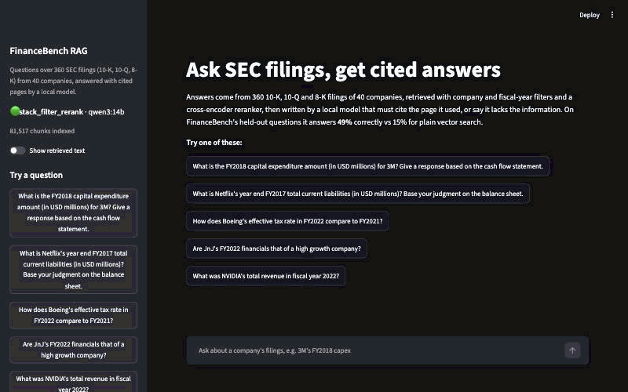
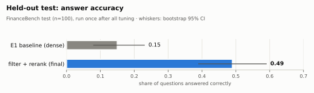
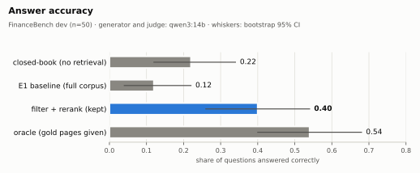
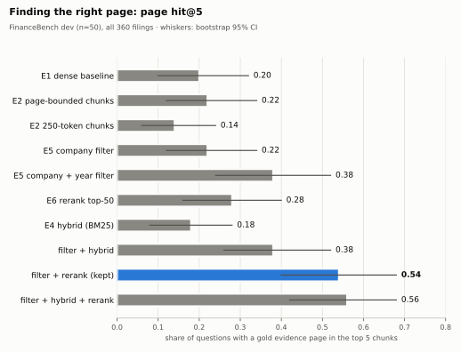
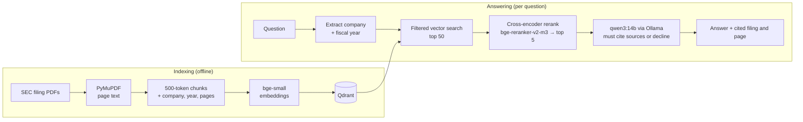

# Production RAG With Evals

[](https://github.com/TejaGelli668/production-rag-with-evals/actions/workflows/ci.yml)

Question answering over real SEC filings (10-K, 10-Q, 8-K) that cites the page it used,
built and tuned through evaluation on the [FinanceBench](https://github.com/patronus-ai/financebench)
benchmark. Every component was kept only if a measured experiment showed it helped, and
everything runs locally on an open model, with no API keys.



## Results

On the full corpus of 360 filings, company and fiscal-year filters plus cross-encoder
reranking take answer accuracy on the **held-out FinanceBench `test` split from 15% to 49%**
(paired Δ **+34 points**, 95% CI [+24, +44]). The split was run once, after all tuning on
`dev`.

<picture>
  <source media="(prefers-color-scheme: dark)" srcset="docs/img/test_correct-dark.svg">
  
</picture>

| Held-out `test`, n = 100 | Dense baseline | **Final system** |
|---|---|---|
| Answered correctly | 15% | **49%** |
| Right filing in the top 5 | 44% | **95%** |
| Right page in the top 5 | 16% | **57%** |
| Answers fully supported by their sources | 91% | 93% |
| Unanswerable questions declined (separate set of 30) | — | 30 / 30 |

On `dev`, where every decision was made, the same change goes from 12% to 40%. That closes
two-thirds of the gap to an oracle that is handed the gold pages (54%):

<picture>
  <source media="(prefers-color-scheme: dark)" srcset="docs/img/end_to_end_correct-dark.svg">
  
</picture>

## What was tried, and what was kept

Each experiment changes one thing and is compared on the same questions with paired bootstrap
CIs. The details, including the negative results, are in [docs/experiments.md](docs/experiments.md).

| Change | Result (dev) | Decision |
|---|---|---|
| **Company + fiscal-year filters** from the question | right page in top 5: 0.20 → 0.38\* | **kept** |
| **Cross-encoder rerank** of the top 50 | with filters: → 0.54\* | **kept** |
| BM25 hybrid search | hurts alone (right filing 0.66 → 0.48\*), nothing with filters | dropped |
| Smaller (250-token) or page-bounded chunks | worse or no change | dropped |
| Markdown table parsing | no gain, even when the model is given the gold page | dropped |
| LLM query rewriting | +0.06 at top 5, CI touches zero | not adopted |
| Stepwise "figures → calculation → answer" prompt | refusals −14 pts\*, accuracy ±0: refusals became wrong answers | not adopted |

<picture>
  <source media="(prefers-color-scheme: dark)" srcset="docs/img/retrieval_page_hit-dark.svg">
  
</picture>

\* 95% CI of the paired difference excludes zero.

## How it works



- **Indexing:** filings are split into 500-token chunks, each tagged with company, filing
  type, fiscal year and page range, then embedded into Qdrant.
- **Query analysis:** the question's company and fiscal year are extracted by rules
  (correct on 50/50 and 48/50 `dev` questions). They become filters, which are relaxed if
  nothing matches.
- **Retrieval:** the top 50 filtered candidates are reranked by a cross-encoder down to 5.
- **Generation:** the model answers only from numbered sources, cites them as `[n]`, and
  starts with "Insufficient information" when the sources don't contain the answer. Each
  `[n]` resolves to a filing and page.

## Run it

Requires [uv](https://docs.astral.sh/uv/), Python 3.12 and [Ollama](https://ollama.com).
Everything runs locally on Apple Silicon or a Linux box; no API keys.

```bash
make setup                                                   # dependencies + git hooks
ollama pull qwen3:14b                                        # the local LLM
make data                                                    # 360 PDFs (~700 MB), checksum-verified
make ingest CONFIG=configs/stack_filter_rerank.yaml          # index (~30 min, resumable)
make serve                                                   # API  -> http://localhost:8000/docs
make ui                                                      # chat -> http://localhost:8501
```

- **API** ([`src/rag/api/`](src/rag/api/)):
  - `POST /ask` returns the answer, sources (filing, page, rerank score, cited or not),
    timings and token usage.
  - `POST /ask/stream` streams the same as server-sent events (sources, then tokens, then
    the final answer).
  - `POST /feedback` records 👍/👎, `GET /health` reports status, and
    `GET /pages/{filing}/{page}.png` renders a page.
  - Every answer and rating is logged by `request_id`, so feedback can be joined to the
    exact answer.
- **UI** ([`ui/app.py`](ui/app.py)): streamed answers, source cards showing the rendered PDF
  page, and 👍/👎.
- **Tracing:** run `make phoenix`, then `RAG_TRACING=1 make serve`. Every request shows up in
  [Arize Phoenix](https://github.com/Arize-ai/phoenix) as `rag.ask → retrieve → rerank` and
  `generate`, with the retrieved documents, scores, prompts and token counts.
- **CLI:** `uv run rag ask --id financebench_id_03282` answers a benchmark question and shows
  the gold answer next to it.
- **Docker:** a `Dockerfile` and `docker-compose.yml` (API, UI, Qdrant server, Phoenix) are
  included but **untested**. See [docs/docker.md](docs/docker.md) for the steps and known risks.

## Evaluation

```bash
uv run rag eval --config configs/stack_filter_rerank.yaml --split dev   # judged run
uv run rag eval --config configs/e1_full.yaml --split dev --retrieval-only   # no LLM
uv run rag compare e1_full__dev stack_filter_rerank__dev                 # paired Δ, 95% CIs
uv run rag analyze stack_filter_rerank__dev                              # where failures happen
uv run rag check-judge                                                   # judge sanity checks
```

- **Cases:** 150 FinanceBench questions (`dev` 50, `test` 100 held out, `ci_smoke` 20), plus
  30 unanswerable questions.
- **Retrieval metrics** (programmatic): right filing, right page, page recall, MRR, and
  **evidence coverage**. Evidence coverage was added because page overlap alone over-credits
  a chunk that touches the right page but misses the actual table row.
- **Answer metrics:** correctness and faithfulness judged by an LLM against a rubric, using
  structured output. Refusals, numeric match and citations are checked programmatically.
- **Error analysis** assigns each failure to the first stage that broke: wrong filing, wrong
  page, evidence missing, refused despite evidence, or wrong despite evidence.
- **Harness:** infra errors are kept out of scores, truncated answers are flagged, every case
  has a full trace, runs resume, and bounds show the range (closed-book 22%, oracle 54% on
  `dev`).

Full methodology: [docs/evaluation.md](docs/evaluation.md).

### CI eval gate

Every push runs lint and the unit tests, then a **retrieval eval gate**, which needs no LLM
and no API keys. It downloads a 51-filing CI corpus (the 20 `ci_smoke` questions' filings
plus same-company filings from neighbouring years as distractors), indexes it on the CI
runner's CPU, and fails the build if retrieval drops below the thresholds in
[`evals/gate.yaml`](evals/gate.yaml). The gate was checked against known regressions:
turning off the filters or switching to 250-token chunks both fail it. The built index is
cached between runs (a cold build is ~55 min on GitHub's 2-core runners, a cached run ~2 min),
and the metrics on the Linux CPU runner match a local Apple GPU run exactly.

## Limitations

- **The judge is the generator.** `qwen3:14b` grades its own answers, because the project
  deliberately runs locally. The correctness judge passes its sanity checks (≥ 98%); the
  faithfulness judge is weaker (84%), so treat faithfulness as approximate. Human calibration
  (`rag label` / `rag calibrate`) is the remaining safeguard.
- **The generator is now the bottleneck.** With retrieval fixed, 18 of 51 `test` failures
  happen after the right evidence was retrieved, and the model tops out at 54% even when given
  the gold pages. It can also misread signs in tables (e.g. Boeing's tax rate).
- **It's cautious.** It declines 26% of answerable `test` questions; in 6 of those the
  evidence was in its context.
- **Reranking costs latency:** retrieval goes from about 0.3 s to 6–7 s per question on an
  M5 Pro shared with the local LLM.
- **Small samples:** with 50 `dev` questions, CIs are about ±14 points, so only large
  effects were resolvable.
- **Unanswerable set:** the 30 unanswerable questions were drafted by an AI and verified
  against the corpus by script, not by a human. None is a near-miss of an answerable question,
  so they are easier than real ambiguity.

## Data

| | |
|---|---|
| Questions | 150 human-labeled questions with answers and evidence pages |
| Corpus | 360 filings · 53k pages · ~45M tokens · 40 companies · FY2015–2024 |
| Splits | `dev` 50 · `test` 100 (held out) · `ci_smoke` 20 (subset of dev), in [`evals/splits/`](evals/splits/) |

Corpus findings that shaped the design: [docs/data_exploration.md](docs/data_exploration.md).
**License:** FinanceBench is CC-BY-NC 4.0; the PDFs are downloaded by script and never
committed.

## Repository layout

```
src/rag/data/      dataset models, loaders, split logic
src/rag/ingest/    parsing, chunking, resumable indexing
src/rag/generate/  LLM providers (Ollama; optional Claude), prompts, citation resolution
src/rag/evals/     cases, metrics, judges, runner, summaries, error analysis, gate, labeling
src/rag/api/       FastAPI service (ask, streaming, feedback, health, page images)
src/rag/           config, embeddings, vector store, query analysis, retrieval, rerank, tracing, CLI
ui/                Streamlit app
configs/           one YAML per experiment; final = stack_filter_rerank.yaml
evals/             splits, custom cases, committed run summaries, judge reports, gate thresholds
scripts/           download, splits, exploration, pre-parsing, charts
docs/              evaluation methodology, experiments, data exploration, charts
tests/             unit tests (no network, no models)
```

Project plan and history: [PLAN.md](PLAN.md).
